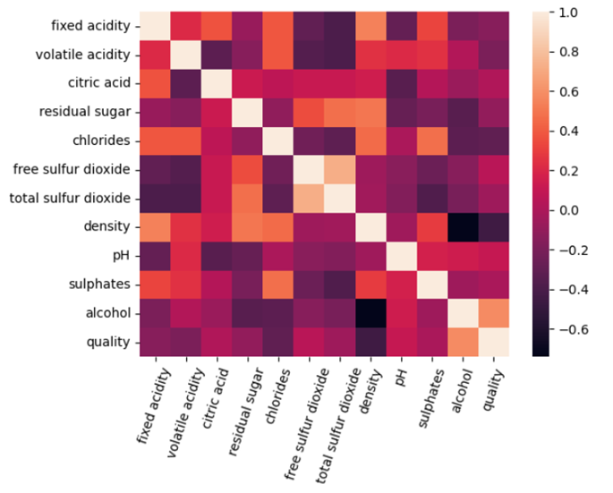
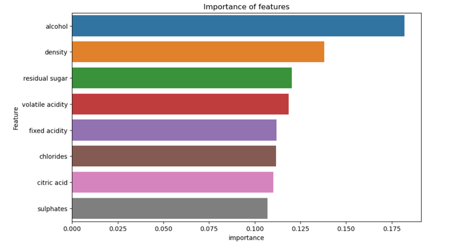
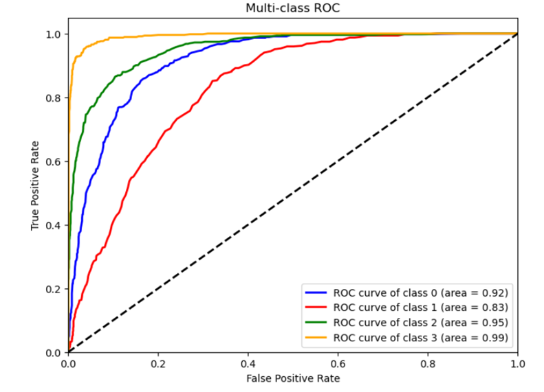

# 🍷 Wine Quality Classification using Machine Learning

## 📌 Overview
This project predicts **wine quality** based on **physicochemical properties** using machine learning. It explores multiple classifiers and evaluates their effectiveness in identifying wine quality categories (Poor, Average, Good, Excellent). The best-performing model (**Random Forest**) achieved an **accuracy of 74.45%**.

---

## 📂 Dataset
- **Source:** [Wine Quality Dataset on Kaggle](https://www.kaggle.com/datasets/rajyellow46/wine-quality)
- **Features:**
  - Fixed acidity, volatile acidity, citric acid, residual sugar, chlorides, free sulfur dioxide, total sulfur dioxide, density, pH, sulphates, alcohol.
  - **Target variable:** Wine quality (originally scored 0-9, reclassified into 4 categories).

---

## 🚀 Methodology
1. **Data Preprocessing**
   - Handling **missing values** and **duplicate rows**.
   - Removing irrelevant features with low correlation.
   - Encoding **wine quality into four categories**:
     - **0:** Poor (0-5)
     - **1:** Average (5-6]
     - **2:** Good (6-7]
     - **3:** Excellent (7-9]

2. **Balancing Classes**
   - **SMOTE (Synthetic Minority Oversampling Technique)** was used to balance the dataset.

3. **Model Selection**
   - Multiple classifiers were tested:
     - ✅ **Random Forest** (🏆 Best Model)
     - 🔹 Support Vector Machine (SVM)
     - 🔹 K-Nearest Neighbors (KNN)
     - 🔹 Decision Tree (DT)

4. **Hyperparameter Tuning**
   - Optimized **Random Forest** with:
     - `n_estimators = 200`
     - `max_depth = 30`
     - `min_samples_split = 2`
     - `min_samples_leaf = 1`
     - `max_features = 'auto'`

---

## 📊 Results & Performance

| Classifier      | Precision | Recall | F1 Score | Accuracy  |
|----------------|-----------|--------|----------|-----------|
| **Random Forest** | **0.73**   | **0.74** | **0.73**  | **74.45%** |
| SVM            | 0.45      | 0.48   | 0.45     | 47.88%    |
| K-Nearest      | 0.64      | 0.65   | 0.64     | 65.31%    |
| Decision Tree  | 0.63      | 0.63   | 0.63     | 63.47%    |

### 🔹 Key Insights:
- **Alcohol, sulphates, and citric acid** are the most influential features.
- **Class 3 (Excellent wines) were the easiest to classify.**
- **Poor and Average wines** had lower AUC scores due to overlapping feature distributions.


---

## 📊 Data Visualizations


### 🔹 **1. Quality Distribution Before & After Preprocessing**
- **Before Preprocessing:**  
    

<br>

- **After Preprocessing (Class Rebalancing with SMOTE):**  
  

---

### 🔹 **2. Correlation Heatmap**
- This heatmap shows relationships between features.
  

---

### 🔹 **3. Feature Importance**
- The most influential features in predicting wine quality.
  

---

### 🔹 **4. ROC Curve**
- The **Multi-class ROC Curve** evaluates classification performance.
  
---

## 📜 How to Run
### **🔧 Installation**
1. **Clone this repository**:
   ```bash
   git clone https://github.com/yourusername/Wine-Quality-Classification.git
   cd Wine-Quality-Classification
